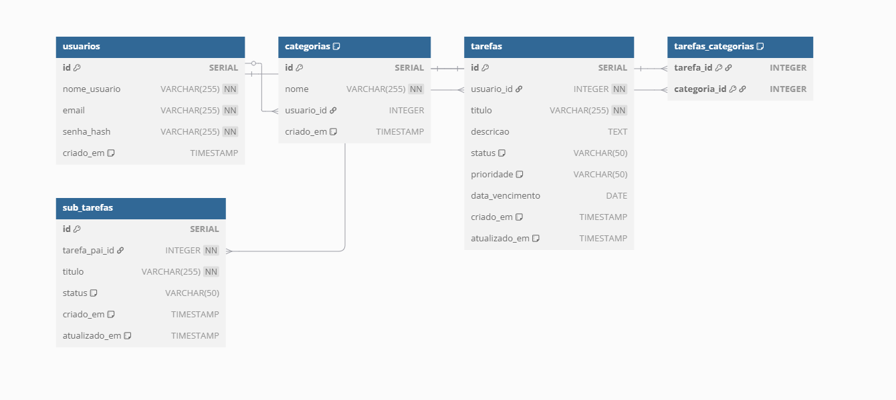

# Documento de Arquitetura Web (WAD) - Gerenciador de Tarefas

## 1. Introdução

Este documento descreve a arquitetura do sistema de Gerenciamento de Tarefas. O objetivo é fornecer uma visão geral dos componentes do sistema, suas interações, as tecnologias utilizadas e o modelo de dados expandido. Este projeto visa criar uma aplicação web robusta, escalável e rica em funcionalidades, seguindo as melhores práticas de desenvolvimento de software e o padrão MVC.

## 2. Visão Geral da Arquitetura

A aplicação é construída utilizando uma arquitetura MVC (Model-View-Controller) no backend, com Node.js e o framework Express.js. O frontend é composto por páginas HTML dinâmicas renderizadas pelo servidor utilizando a template engine EJS, com interações no lado do cliente aprimoradas por JavaScript.

-   **Frontend (View)**: Interface do usuário renderizada com EJS e estilizada com CSS. Interações dinâmicas são tratadas com JavaScript.
-   **Backend (Controller & Model)**:
    -   **Controladores (`/controllers`)**: Gerenciam a lógica de requisição/resposta, validam dados e interagem com os modelos.
    -   **Modelos (`/models`)**: Encapsulam a lógica de negócios e a interação com o banco de dados. São responsáveis pela manipulação e persistência dos dados.
    -   **Rotas (`/routes`)**: Mapeiam os endpoints da API para os respectivos métodos dos controladores.
-   **Banco de Dados**: PostgreSQL e Supabase.

## 3. Modelo de Dados (Diagrama do Banco de Dados)

**Descrição das Tabelas Principais:**

-   **`usuarios`**: Armazena informações sobre os usuários do sistema (id, nome_usuario, email, senha_hash, criado_em).
-   **`categorias`**: Armazena as categorias que podem ser associadas às tarefas. Cada categoria pode ser específica de um usuário ou global (id, nome, usuario_id, criado_em).
-   **`tarefas`**: Contém os detalhes das tarefas criadas pelos usuários, incluindo o novo campo `priority` (id, usuario_id, titulo, descricao, status, prioridade, data_vencimento, criado_em, atualizado_em).
-   **`tarefas_categorias`**: Tabela de junção que implementa o relacionamento muitos-para-muitos entre tarefas e categorias (tarefa_id, categoria_id).
-   **`sub_tarefas`**: Armazena subtarefas vinculadas a uma tarefa principal, permitindo um detalhamento maior das atividades (id, tarefa_pai_id, titulo, status, criado_em, atualizado_em).

O script SQL completo para a criação desta estrutura está disponível no arquivo `init.sql`.

## 4. Tecnologias Utilizadas

-   **Backend**: Node.js, Express.js
-   **Frontend**: EJS, HTML, CSS, JavaScript
-   **Banco de Dados**: PostgreSQL, Supabase
-   **Gerenciamento de Dependências**: npm
-   **Controle de Versão**: Git

## 5. Estrutura do Projeto

Consulte a seção "Estrutura de Pastas e Arquivos Principais" no arquivo `README.md` para uma descrição detalhada da organização do projeto.