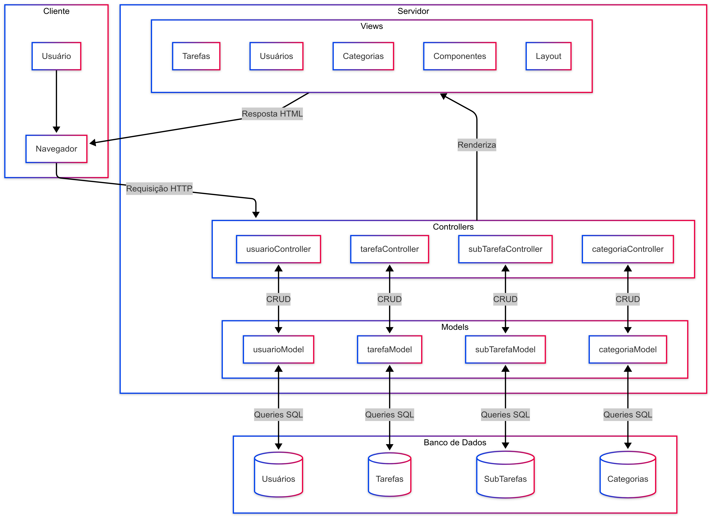

# Documento de Arquitetura Web (WAD) - Gerenciador de Tarefas

## 1. Introdução

Este documento descreve a arquitetura do sistema de Gerenciamento de Tarefas. O objetivo é fornecer uma visão geral dos componentes do sistema, suas interações, as tecnologias utilizadas e o modelo de dados expandido. Este projeto visa criar uma aplicação web robusta, escalável e rica em funcionalidades, seguindo as melhores práticas de desenvolvimento de software e o padrão MVC.


## 2. Visão Geral da Arquitetura

A aplicação é construída utilizando uma arquitetura MVC (Model-View-Controller) no backend, com Node.js e o framework Express.js. O frontend é composto por páginas HTML dinâmicas renderizadas pelo servidor utilizando a template engine EJS, com interações no lado do cliente aprimoradas por JavaScript.

-   **Frontend (View)**: Interface do usuário renderizada com EJS e estilizada com CSS. Interações dinâmicas são tratadas com JavaScript.
-   **Backend (Controller & Model)**:
    -   **Controladores (`/controllers`)**: Gerenciam a lógica de requisição/resposta, validam dados e interagem com os modelos.
    -   **Modelos (`/models`)**: Encapsulam a lógica de negócios e a interação com o banco de dados. São responsáveis pela manipulação e persistência dos dados.
    -   **Rotas (`/routes`)**: Mapeiam os endpoints da API para os respectivos métodos dos controladores.
-   **Banco de Dados**: PostgreSQL e Supabase.

### 2.1. Diagrama de Arquitetura MVC

O diagrama abaixo ilustra a arquitetura MVC do sistema e os fluxos de comunicação entre os diferentes componentes:



**Explicação do Diagrama de Arquitetura:**

1. **Cliente**:
   - **Usuário**: Representa o usuário final que interage com a aplicação.
   - **Navegador**: Interface pela qual o usuário acessa a aplicação, enviando requisições HTTP para o servidor e recebendo respostas HTML.

2. **Servidor**:
   - **Views**: Compõem a camada de visualização da arquitetura MVC, responsável pela interface do usuário.
     - **Tarefas, Usuários, Categorias**: Páginas específicas para manipulação dessas entidades.
     - **Componentes**: Elementos reutilizáveis da interface.
     - **Layout**: Estrutura visual comum compartilhada entre as páginas.

   - **Controllers**: A camada que processa requisições do cliente, implementa a lógica de negócios e coordena a resposta.
     - **usuarioController**: Gerencia operações relacionadas a usuários.
     - **tarefaController**: Gerencia operações relacionadas a tarefas.
     - **subTarefaController**: Gerencia operações relacionadas a subtarefas.
     - **categoriaController**: Gerencia operações relacionadas a categorias.

   - **Models**: A camada que interage diretamente com o banco de dados.
     - **usuarioModel**: Implementa a lógica de acesso aos dados de usuários.
     - **tarefaModel**: Implementa a lógica de acesso aos dados de tarefas.
     - **subTarefaModel**: Implementa a lógica de acesso aos dados de subtarefas.
     - **categoriaModel**: Implementa a lógica de acesso aos dados de categorias.

3. **Fluxo de Dados**:
   - **Requisição HTTP**: O navegador envia requisições para os Controllers.
   - **CRUD**: Os Controllers realizam operações CRUD através dos Models.
   - **Queries SQL**: Os Models executam consultas SQL no banco de dados.
   - **Renderiza**: Os Controllers processam dados e renderizam as Views.
   - **Resposta HTML**: As Views geram conteúdo HTML que é enviado de volta ao navegador.

4. **Banco de Dados**: Armazena os dados persistentes da aplicação em tabelas relacionais.
   - **Usuários, Tarefas, SubTarefas, Categorias**: Tabelas principais do sistema.

## 3. Modelo de Dados (Diagrama do Banco de Dados)


**Descrição das Tabelas Principais:**

-   **`usuarios`**: Armazena informações sobre os usuários do sistema (id, nome_usuario, email, senha_hash, criado_em).
-   **`categorias`**: Armazena as categorias que podem ser associadas às tarefas. Cada categoria pode ser específica de um usuário ou global (id, nome, usuario_id, criado_em).
-   **`tarefas`**: Contém os detalhes das tarefas criadas pelos usuários, incluindo o novo campo `priority` (id, usuario_id, titulo, descricao, status, prioridade, data_vencimento, criado_em, atualizado_em).
-   **`tarefas_categorias`**: Tabela de junção que implementa o relacionamento muitos-para-muitos entre tarefas e categorias (tarefa_id, categoria_id).
-   **`sub_tarefas`**: Armazena subtarefas vinculadas a uma tarefa principal, permitindo um detalhamento maior das atividades (id, tarefa_pai_id, titulo, status, criado_em, atualizado_em).

### 3.1. Modelo Físico do Banco de Dados

Abaixo está o script SQL completo para a criação da estrutura do banco de dados, com explicações detalhadas:

```sql
-- Criação da tabela de usuários
CREATE TABLE usuarios (
    id SERIAL PRIMARY KEY,                                    -- Identificador único do usuário com auto-incremento
    nome_usuario VARCHAR(255) UNIQUE NOT NULL,                -- Nome de usuário único
    email VARCHAR(255) UNIQUE NOT NULL,                       -- Email único
    senha_hash VARCHAR(255) NOT NULL,                         -- Hash da senha para segurança
    criado_em TIMESTAMP WITH TIME ZONE DEFAULT CURRENT_TIMESTAMP -- Data de criação com fuso horário
);

-- Criação da tabela de categorias
CREATE TABLE categorias (
    id SERIAL PRIMARY KEY,                                    -- Identificador único da categoria com auto-incremento
    nome VARCHAR(255) NOT NULL,                               -- Nome da categoria
    usuario_id INTEGER REFERENCES usuarios(id) ON DELETE CASCADE, -- Referência ao usuário (proprietário) com exclusão em cascata
    criado_em TIMESTAMP WITH TIME ZONE DEFAULT CURRENT_TIMESTAMP, -- Data de criação com fuso horário
    UNIQUE (usuario_id, nome)                                 -- Garante que um usuário não pode ter categorias com nomes duplicados
);

-- Criação da tabela de tarefas
CREATE TABLE tarefas (
    id SERIAL PRIMARY KEY,                                    -- Identificador único da tarefa com auto-incremento
    usuario_id INTEGER REFERENCES usuarios(id) ON DELETE CASCADE NOT NULL, -- Referência obrigatória ao usuário com exclusão em cascata
    titulo VARCHAR(255) NOT NULL,                             -- Título da tarefa
    descricao TEXT,                                           -- Descrição opcional da tarefa
    status VARCHAR(50) DEFAULT 'pendente' CHECK (status IN ('pendente', 'em_progresso', 'concluida', 'cancelada')), -- Status com validação de valores permitidos
    prioridade VARCHAR(50) DEFAULT 'Media' CHECK (prioridade IN ('Baixa', 'Media', 'Alta', 'Urgente')), -- Prioridade com validação de valores permitidos
    data_vencimento DATE,                                     -- Data de vencimento opcional
    criado_em TIMESTAMP WITH TIME ZONE DEFAULT CURRENT_TIMESTAMP, -- Data de criação com fuso horário
    atualizado_em TIMESTAMP WITH TIME ZONE DEFAULT CURRENT_TIMESTAMP -- Data de atualização com fuso horário
);

-- Tabela de relacionamento muitos-para-muitos entre tarefas e categorias
CREATE TABLE tarefas_categorias (
    tarefa_id INTEGER REFERENCES tarefas(id) ON DELETE CASCADE,    -- Referência à tarefa com exclusão em cascata
    categoria_id INTEGER REFERENCES categorias(id) ON DELETE CASCADE, -- Referência à categoria com exclusão em cascata
    PRIMARY KEY (tarefa_id, categoria_id)                          -- Chave primária composta
);

-- Criação da tabela de subtarefas
CREATE TABLE sub_tarefas (
    id SERIAL PRIMARY KEY,                                    -- Identificador único da subtarefa com auto-incremento
    tarefa_pai_id INTEGER REFERENCES tarefas(id) ON DELETE CASCADE NOT NULL, -- Referência obrigatória à tarefa pai com exclusão em cascata
    titulo VARCHAR(255) NOT NULL,                             -- Título da subtarefa
    status VARCHAR(50) DEFAULT 'pendente' CHECK (status IN ('pendente', 'em_progresso', 'concluida')), -- Status com validação de valores permitidos
    criado_em TIMESTAMP WITH TIME ZONE DEFAULT CURRENT_TIMESTAMP, -- Data de criação com fuso horário
    atualizado_em TIMESTAMP WITH TIME ZONE DEFAULT CURRENT_TIMESTAMP -- Data de atualização com fuso horário
);

-- Índices para otimizar consultas frequentes
CREATE INDEX idx_tarefas_usuario_id ON tarefas(usuario_id);       -- Índice para melhorar consultas de tarefas por usuário
CREATE INDEX idx_tarefas_status ON tarefas(status);               -- Índice para melhorar consultas de tarefas por status
CREATE INDEX idx_tarefas_prioridade ON tarefas(prioridade);       -- Índice para melhorar consultas de tarefas por prioridade
CREATE INDEX idx_tarefas_data_vencimento ON tarefas(data_vencimento); -- Índice para melhorar consultas de tarefas por data de vencimento
CREATE INDEX idx_categorias_usuario_id ON categorias(usuario_id); -- Índice para melhorar consultas de categorias por usuário
CREATE INDEX idx_sub_tarefas_tarefa_pai_id ON sub_tarefas(tarefa_pai_id); -- Índice para melhorar consultas de subtarefas por tarefa pai

-- Função para atualizar automaticamente o timestamp de atualização
CREATE OR REPLACE FUNCTION atualizar_coluna_atualizado_em()
RETURNS TRIGGER AS $$
BEGIN
   NEW.atualizado_em = NOW();  -- Atualiza o campo com a data/hora atual
   RETURN NEW;
END;
$$ language 'plpgsql';

-- Trigger para atualizar o timestamp de atualização nas tarefas
CREATE TRIGGER trigger_atualizar_tarefas_atualizado_em
BEFORE UPDATE ON tarefas
FOR EACH ROW
EXECUTE FUNCTION atualizar_coluna_atualizado_em();

-- Trigger para atualizar o timestamp de atualização nas subtarefas
CREATE TRIGGER trigger_atualizar_sub_tarefas_atualizado_em
BEFORE UPDATE ON sub_tarefas
FOR EACH ROW
EXECUTE FUNCTION atualizar_coluna_atualizado_em();
```

### 3.2. Explicação do Modelo de Dados

1. **Tabela `usuarios`**:
   - Armazena informações básicas do usuário
   - O campo `id` é a chave primária auto-incrementada
   - Impõe unicidade para `nome_usuario` e `email`
   - Armazena `senha_hash` para garantir a segurança das credenciais
   - Mantém registro de quando o usuário foi criado

2. **Tabela `categorias`**:
   - Armazena categorias para classificação de tarefas
   - Cada categoria pode pertencer a um usuário específico (ou ser global, se `usuario_id` for nulo)
   - Impede que um usuário crie duas categorias com o mesmo nome
   - A exclusão de um usuário remove automaticamente suas categorias (ON DELETE CASCADE)

3. **Tabela `tarefas`**:
   - Contém as tarefas criadas pelos usuários
   - Inclui campos para título, descrição, status, prioridade e data de vencimento
   - Restringe os valores de `status` e `prioridade` a conjuntos predefinidos
   - Rastreia quando a tarefa foi criada e atualizada
   - A exclusão de um usuário remove automaticamente suas tarefas (ON DELETE CASCADE)

4. **Tabela `tarefas_categorias`**:
   - Implementa o relacionamento muitos-para-muitos entre tarefas e categorias
   - Permite que uma tarefa pertença a várias categorias e vice-versa
   - A exclusão de uma tarefa ou categoria remove automaticamente os relacionamentos associados

5. **Tabela `sub_tarefas`**:
   - Armazena subtarefas vinculadas a uma tarefa principal
   - Similar à tabela `tarefas`, mas com menos campos
   - A exclusão de uma tarefa remove automaticamente suas subtarefas

6. **Índices**:
   - Criados para otimizar consultas frequentes, como busca de tarefas por usuário, status, prioridade ou data de vencimento

7. **Triggers**:
   - Implementado para atualizar automaticamente o campo `atualizado_em` sempre que uma tarefa ou subtarefa é modificada

### 3.3. Executando o Script do Banco de Dados

Para executar o script de inicialização do banco de dados, siga os passos abaixo:

1. Certifique-se de que PostgreSQL está instalado.
2. Execute o comando:

```bash
npm run init-db
```

Este comando executa o script `src/scripts/runSQLScript.js`, que por sua vez:
1. Conecta ao banco de dados usando as configurações em `db.js`
2. Lê o arquivo `src/scripts/init.sql` contendo as definições das tabelas
3. Executa o script SQL para criar as tabelas, índices, funções e triggers
4. Exibe mensagens de sucesso ou erro após a tentativa de execução

## 4. Tecnologias Utilizadas

-   **Backend**: Node.js, Express.js
-   **Frontend**: EJS, HTML, CSS, JavaScript
-   **Banco de Dados**: PostgreSQL, Supabase
-   **Gerenciamento de Dependências**: npm
-   **Controle de Versão**: Git

## 5. Estrutura do Projeto

Consulte a seção "Estrutura de Pastas e Arquivos Principais" no arquivo `README.md` para uma descrição detalhada da organização do projeto.