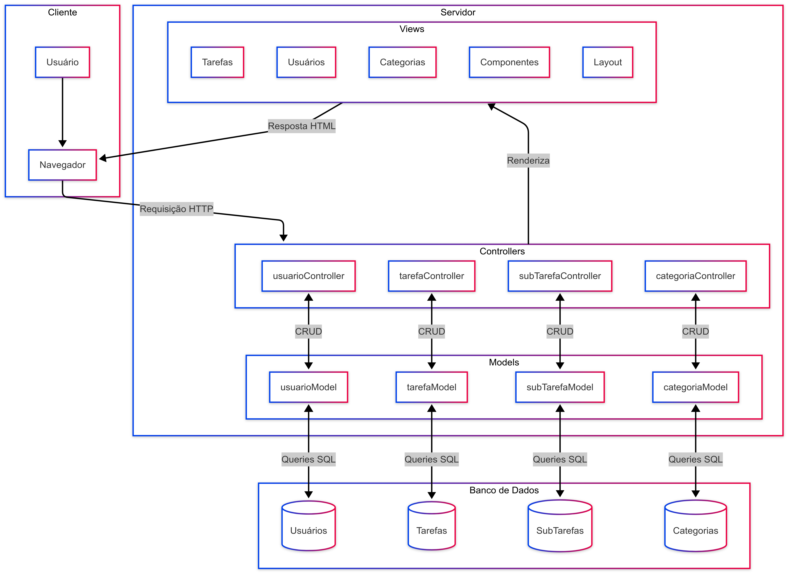

# Documentação do Projeto: Gerenciador de Tarefas

## Introdução

Este projeto consiste na criação de uma aplicação web completa, seguindo o padrão de arquitetura MVC. O objetivo principal é desenvolver um sistema de gerenciamento de tarefas robusto e flexível, permitindo aos usuários criar, organizar, categorizar, priorizar e acompanhar suas atividades diárias, incluindo a capacidade de dividi-las em subtarefas.

## Estrutura de Pastas e Arquivos Principais

```
Projeto-Individual-Inteli-M2/
│
├── assets/                
│   ├── bancoRelacional.png
│   └── diagrama.png
├── documentos/           
│   └── wad.md
├── node_modules/                
│   └── ...
├── public/
│   ├── css/
│   └── js/
├── src/                
│   ├── config/
│   │   └── db.js
│   ├── controllers/
│   │   ├── categoriaController.js
│   │   ├── exampleController.js
│   │   ├── subTarefaController.js
│   │   ├── tarefaController.js
│   │   └── usuarioController.js
│   ├── middlewares/
│   │   └── authMiddleware.js
│   ├── models/
│   │   ├── categoriaModel.js
│   │   ├── exampleModel.js
│   │   ├── subTarefaModel.js
│   │   ├── tarefaModel.js
│   │   └── usuarioModel.js
│   ├── routes/
│   │   ├── categoriaRoutes.js
│   │   ├── exampleRoutes.js
│   │   ├── frontRoutes.js
│   │   ├── subTarefaRoutes.js
│   │   ├── tarefaRoutes.js
│   │   └── usuarioRoutes.js
│   ├── scripts/
│   │   ├── init.sql
│   │   └── runSQLScript.js
│   ├── views/
│   │   ├── categorias/
│   │   │   ├── create.ejs
│   │   │   ├── edit.ejs
│   │   │   └── index.ejs
│   │   ├── components/
│   │   │   └── header.ejs
│   │   ├── css/
│   │   │   └── style.css
│   │   ├── error.ejs
│   │   ├── home.ejs
│   │   ├── layout/
│   │   │   └── main.ejs
│   │   ├── pages/
│   │   │   └── page1.ejs
│   │   ├── tarefas/
│   │   │   ├── create.ejs
│   │   │   ├── edit.ejs
│   │   │   ├── index.ejs
│   │   │   └── show.ejs
│   │   └── usuarios/
│   │       ├── index.ejs
│   │       ├── login.ejs
│   │       ├── perfil.ejs
│   │       └── registro.ejs
├── .env            
├── .env.example               
├── .gitignore              
├── package-lock.json
├── package.json               
├── README.md
└── server.js                      
```

## Arquitetura MVC

Este projeto utiliza o padrão de arquitetura Model-View-Controller (MVC), que organiza o código em três componentes principais:

- **Model (Modelo)**: Responsável pela manipulação dos dados e lógica de negócios.
- **View (Visão)**: Responsável pela apresentação dos dados ao usuário.
- **Controller (Controlador)**: Atua como intermediário entre o Model e a View, processando as requisições do usuário.

Para uma visão detalhada da arquitetura, consulte o [Documento de Arquitetura Web (WAD)](./documentos/wad.md), que inclui diagramas e explicações completas.



## Funcionalidades Principais

- **Gerenciamento de Usuários**: Cadastro, login, edição de perfil.
- **Gerenciamento de Tarefas**: Criação, edição, listagem e exclusão de tarefas.
- **Categorização**: Organização de tarefas por categorias personalizadas.
- **Priorização**: Atribuição de níveis de prioridade às tarefas (Baixa, Média, Alta, Urgente).
- **Subtarefas**: Divisão de tarefas complexas em subtarefas gerenciáveis.
- **Status da Tarefa**: Acompanhamento do progresso através de estados (pendente, em progresso, concluída, cancelada).

## Modelo do Banco de Dados

-   **Usuarios**: Tabela de usuários (`usuarios`). Campos como `nome_usuario`, `email`, `senha_hash`, `criado_em`.
-   **Tarefas**: Tabela de tarefas (`tarefas`) com campos como `usuario_id`, `titulo`, `descricao`, `status`, `prioridade`, `data_vencimento`, `criado_em`, `atualizado_em`.
-   **Categorias**: Tabela para categorizar tarefas (`categorias`). Campos como `nome`, `usuario_id`, `criado_em`. Um usuário pode ter suas próprias categorias.
-   **Tarefas_Categorias**: Tabela de junção para o relacionamento muitos-para-muitos entre tarefas e categorias (`tarefas_categorias`). Campos: `tarefa_id`, `categoria_id`.
-   **Sub_Tarefas**: Tabela para subtarefas (`sub_tarefas`), vinculadas a uma tarefa principal. Campos como `tarefa_pai_id`, `titulo`, `status`, `criado_em`, `atualizado_em`.

O script SQL completo para a criação do banco de dados pode ser encontrado em `src/scripts/init.sql`.

## Como Executar o Projeto Localmente

1.  **Clone do projeto**:
    -   Clone o repositório do projeto com: 
    ```bash 
    git clone https://github.com/Reimar-Coelho/Projeto-Individual-Inteli-M2.git
    ```

2.  **Pré-requisitos**:
    -   Node.js e npm instalados.
    -   PostgreSQL instalado e em execução.

3.  **Configuração do Banco de Dados**:
    -   Copie e cole o arquivo `.env.example` e renomeie ele para `.env`. O arquivo `.env` contém as variáveis de ambiente necessárias para a configuração do banco de dados, você pode usar as variáveis de ambiente do seu próprio banco de dados PostgreSQL para rodar a aplicação ou usar as de exemplo que já estão disponíveis no `.env.example`.

4.  **Instalação das Dependências**:
    ```bash
    cd Projeto-Individual-Inteli-M2
    npm install
    ```

5.  **Execução da Aplicação**:
    ```bash
    npm run init-db    # Inicializa o banco de dados com as tabelas necessárias
    npm run init-app   # Inicia o servidor da aplicação
    ```
    O servidor estará rodando em `http://localhost:5500`.

## Scripts Disponíveis

- **npm run init-db**: Executa o script `src/scripts/runSQLScript.js` para criar as tabelas do banco de dados.
- **npm run init-app**: Inicia a aplicação através do arquivo `server.js`.

## Documentação Detalhada

Para uma documentação mais detalhada da arquitetura, consulte o [Documento de Arquitetura Web (WAD)](./documentos/wad.md), que inclui:

- Diagrama detalhado da arquitetura MVC
- Modelo físico completo do banco de dados
- Explicações sobre cada componente e seus relacionamentos
- Fluxo de dados do sistema
